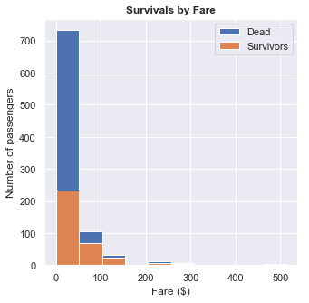

# Titanic-Data-Analysis-Project
[My Analysis](Data%20Analysis%20Project.ipynb) of the [Titanic Dataset](https://www.kaggle.com/c/titanic/data) in Jupyter Notebook

## Background
I wanted to see what the likelihood of survival was for those onboard the Titanic. I also wanted to see if there were any correlations between survival and various factors available in the dataset (i.e. gender, economic status, fare (cabin level), age, whether they were travelling with family).

## My Plots

## Results

* The overall survival rate was **_38%_**, which is higher than what it seemed like in the movie!

* **_Children aged <13_** had a much higher chance of survival

* Many more **_women_** than **_men_** survived

* People travelling with other family members were **_almost 2x more likely to survive_**

## Conclusion
The results found here are in line with previous research on the likelihood of survival in dangerous journeys, particularly the findings from the [Donner Party tragedy](https://www.history.com/topics/westward-expansion/donner-party) (McCurdy, 1994):

|Tragedy                                                              |Titanic           |Donner Party          |
|:--------------------------------------------------------------------|:----------------:|:--------------------:|
|**Year**                                                             |1909              |1846                  |
|**Overall Survival**                                                 |38%               |54%*                  |
|**Age Category with the Highest Survival Rate**                      |Children aged <13 |Children aged 6-14    |
|**Gender with the Higher Survival Rate**                             |Women             |Women                 |
|**Survival Likelihood of Passengers With Family vs. Without Family** |1.7x survival rate|2x survival rate      |

* Out of 83 people

 
**So always try to travel with family! And don't worry about the kids!**
